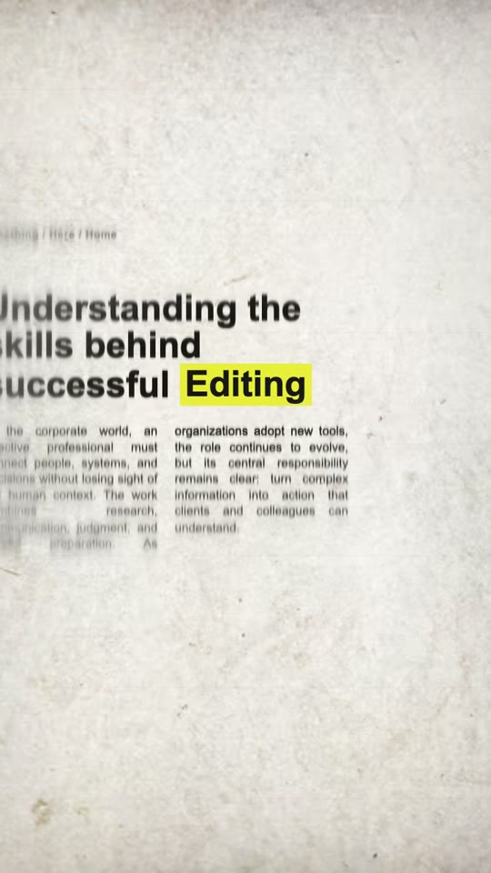

# Remotion Newspaper Match Cut

A Codex Skill for generating newspaper and magazine match-cut openers with Remotion. One highlighted keyword stays locked in place while complete editorial layouts, fonts, columns, crops, and paper textures switch around it.

[中文](#中文) · [English](#english)

---

## 中文

这是一个用于生成报纸 / 杂志 Match Cut 片头的 Codex Skill。焦点词始终处在原始标题句子中，程序通过移动整张报纸保持它的位置稳定；周围文字则从清晰中心逐渐过渡到外圈强模糊。

### 效果演示

#### Editing · 英文版

[](examples/editing-demo.mp4)

[▶ 播放或下载 Editing MP4](examples/editing-demo.mp4)

#### 创作 · 中文版

[](examples/creation-zh-demo.mp4)

[▶ 播放或下载“创作”MP4](examples/creation-zh-demo.mp4)

两段示例均为 720 × 1280、30fps、约 8 秒，并按照音乐节奏切换版式。

### 功能

- 支持中文和英文。
- 支持中文 / 英文默认完整标题与正文。
- 支持用户提供 1–24 组自定义标题和正文。
- 焦点词只渲染一次，保留在标题的正常文字流中。
- 自动测量焦点词，并移动整张报纸完成位置对齐。
- 清晰中心、轻模糊过渡层、强模糊外圈三层空间景深。
- 六种字体版式、两栏 / 三栏排版和六种纸张背景。
- 支持自定义高亮色、模糊强度、焦点位置、缩放与切换速度。
- 所有动画由 Remotion 帧驱动，可重复稳定渲染。

### Skill 的首次交互

Skill 每次开始新任务时必须按顺序提问：

1. `这次报纸动画使用中文还是英文？`
2. `文字内容由你提供完整标题和正文，还是使用所选语言的默认文本自动生成？`

Skill 不会跳过语言选择，也不会擅自决定使用默认文案。

### 安装到 Codex

```bash
git clone https://github.com/loool-new/newspaper-match-cut.git \
  ~/.codex/skills/remotion-newspaper-match-cut
```

重新启动 Codex 后，可以直接这样调用：

```text
使用 remotion-newspaper-match-cut 制作一个报纸 Match Cut 片头。
```

### 创建中文默认文案项目

```bash
python3 scripts/create_newspaper_match_cut.py ./my-newspaper-intro \
  --language zh \
  --keyword "创作" \
  --kicker "创作实验室" \
  --width 720 \
  --height 1280
```

### 使用自定义中文文案

每条标题必须包含一次 `{{keyword}}`，它标记焦点词在原句中的位置。

```bash
python3 scripts/create_newspaper_match_cut.py ./custom-intro \
  --language zh \
  --keyword "剪辑" \
  --headline "如何让{{keyword}}拥有更强的节奏感" \
  --headline "重新理解短视频{{keyword}}的视觉语言" \
  --body "优秀的剪辑不仅连接镜头，也通过节奏和声音组织观众的注意力。" \
  --body "完整的叙事来自清晰的信息层级，以及对画面变化时机的准确判断。"
```

标题和正文数组会分别按照版式序号循环，因此可以只提供一组，也可以为每一种报纸提供不同内容。

### 运行与渲染

```bash
cd my-newspaper-intro
npm install
npm run typecheck
npm run studio
npm run render
```

### 主要参数

| 参数 | 作用 |
| --- | --- |
| `language` | `zh` 或 `en` |
| `keyword` | 唯一清晰并高亮的焦点词 |
| `kicker` | 报纸页眉小字 |
| `topic` | 默认标题中的主题文字 |
| `headlineTemplates` | 包含一次 `{{keyword}}` 的完整标题数组 |
| `bodyParagraphs` | 完整正文段落数组 |
| `accentColor` | 焦点词高亮颜色 |
| `cutIntervalFrames` | 默认版式切换间隔 |
| `focusY` | 焦点词在画面中的纵向位置 |
| `blurMin` / `blurMax` | 中间层与外圈模糊强度 |
| `focusScale` | 报纸整体缩放 |

### 工作原理

1. 每种版式先正常排出完整标题和正文。
2. 标题中的 `{{keyword}}` 被替换成唯一的原生焦点词节点。
3. 程序测量该节点，再平移和缩放整张报纸，使焦点词落在共享锚点。
4. 相同排版被渲染为清晰、轻模糊和强模糊三层。
5. 三层使用围绕焦点词的宽椭圆遮罩混合，模糊随距离增加，但字形不会向外拉伸。
6. 字体、正文分栏、裁切和纸张纹理在切点处整体变化。

---

## English

This Codex Skill creates newspaper or magazine match-cut intros in Remotion. The highlighted keyword remains part of its original headline and stays fixed on screen while the complete editorial page changes around it.

### Demos

#### Editing · English

[](examples/editing-demo.mp4)

[▶ Watch or download the Editing MP4](examples/editing-demo.mp4)

#### 创作 · Chinese

[](examples/creation-zh-demo.mp4)

[▶ Watch or download the 创作 MP4](examples/creation-zh-demo.mp4)

Both demos are 720 × 1280, 30fps, approximately eight seconds long, and switch editions on musical beats.

### Features

- Chinese and English language modes.
- Complete built-in headline and body copy for both languages.
- One to 24 user-supplied headline and body variants.
- A single native keyword span that remains inside the original sentence.
- Whole-page measurement and alignment around the keyword.
- Three-stage spatial focus falloff: sharp center, soft transition, strong outer blur.
- Six editorial layouts, varied font stacks, column systems, crops, and paper textures.
- Adjustable highlight color, blur strength, focus position, scale, and cut speed.
- Deterministic frame-driven Remotion rendering.

### Required first interaction

At the start of every new request, the Skill asks these questions in order:

1. Should the newspaper animation use Chinese or English?
2. Will the user provide complete headlines and body copy, or should the Skill use default copy in the selected language?

The Skill must not silently choose either option.

### Install in Codex

```bash
git clone https://github.com/loool-new/newspaper-match-cut.git \
  ~/.codex/skills/remotion-newspaper-match-cut
```

Restart Codex, then invoke it with a natural-language request such as:

```text
Use remotion-newspaper-match-cut to create a newspaper match-cut opener.
```

### Create a project with default English copy

```bash
python3 scripts/create_newspaper_match_cut.py ./my-newspaper-intro \
  --language en \
  --keyword "Editing" \
  --kicker "CREATIVE STUDIO" \
  --width 720 \
  --height 1280
```

### Use custom copy

Every complete headline must contain exactly one `{{keyword}}` marker.

```bash
python3 scripts/create_newspaper_match_cut.py ./custom-intro \
  --language en \
  --keyword "Editing" \
  --headline "Understanding the rhythm behind successful {{keyword}}" \
  --headline "How modern tools reshape creative {{keyword}}" \
  --body "Strong editing connects images, sound, pacing, and attention into one coherent experience." \
  --body "A clear visual hierarchy helps viewers understand each decision without losing momentum."
```

Headline and body arrays cycle independently by edition index, so one entry can be reused or every edition can receive unique copy.

### Run and render

```bash
cd my-newspaper-intro
npm install
npm run typecheck
npm run studio
npm run render
```

### Main props

| Prop | Purpose |
| --- | --- |
| `language` | `zh` or `en` |
| `keyword` | The single sharp highlighted word |
| `kicker` | Small newspaper breadcrumb or kicker |
| `topic` | Topic text used by default headlines |
| `headlineTemplates` | Complete headlines containing one `{{keyword}}` marker |
| `bodyParagraphs` | Complete body paragraphs |
| `accentColor` | Keyword highlight color |
| `cutIntervalFrames` | Default edition-switch interval |
| `focusY` | Vertical position of the shared keyword anchor |
| `blurMin` / `blurMax` | Transition and outer blur strength |
| `focusScale` | Whole-page scale |

### How it works

1. Each edition lays out a complete headline and body paragraph normally.
2. `{{keyword}}` becomes the single native focus-word element inside that headline.
3. The element is measured and the whole page is translated and scaled to a shared anchor.
4. The identical page is rendered as sharp, medium-blur, and strong-blur text layers.
5. Broad elliptical masks blend those layers around the measured keyword. Blur increases with distance without stretching glyphs outward.
6. Fonts, columns, crops, and paper textures change as complete editions at each cut.

## Repository structure

```text
SKILL.md                         Codex workflow and visual rules
agents/openai.yaml               Skill display metadata and default prompt
assets/remotion-template/        Reusable Remotion project template
examples/                        Editing and 创作 MP4 demos and preview images
references/visual-recipe.md      Timing, layout, blur, and verification guide
scripts/create_newspaper_match_cut.py
```

## Requirements

- Python 3
- Node.js 20 or newer
- npm
- Remotion-compatible Chromium for preview and rendering

The template uses portable system-font stacks. Exact typography can vary by operating system; supply licensed local fonts when exact visual matching matters. Ensure you have permission to redistribute any replacement fonts, newspaper scans, paper textures, and music used in exported videos.
